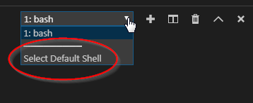
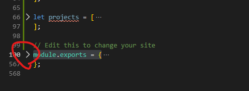

<h1 align="center">
  <a style="font-style: italic" href="https://app-web.netlify.com/">Template</a> Website
</h1>

<h4 align="center">Template Website | <a href="https://app-web.netlify.com/" target="_blank">app-web.netlify.com</a></h4>

<blockquote align="center">
  <em style="font-weight: bold">Template Website</em> is a lightweight, fast, and efficient website template that is hosted on <a href="netlify.com">netlify</a>, and optimized for desktops, mobile phones, and tablets. It is designed for present ideas, dreams and passions, let's persue yours together.
</blockquote>

<p align="center">
  <a href="#getting-started">Getting started</a>&nbsp;|&nbsp;<a href="#documentation">Documentation</a>&nbsp;|&nbsp;<a href="#demos-and-examples">Demos and examples</a>&nbsp;|&nbsp;<a href="#browser-support">Browser support</a>
</p>

## Getting started

### *Prerequisites*
* Github Account (go to [github](github.com) to create an account)
* Website Repository (I would have already provided you with this)

If you don't want to do all this work you can leave it to me to design and post your website.

---

### *Edit Online*
Click [Gitpod](https://www.gitpod.io/#https://github.com/okikio/okikio) and sign up, to edit online and have everything you need to start editing all ready for you, if you use this option **skip** the download section and go straight to the [Start](#start) portion of the **Usage** section, of **Getting Started**.

--- 

### *Download*

**Install Node.js**

Node.js is a JavaScript runtime built on Chrome's V8 JavaScript engine. For more information on using Node.js, see the [Node.js Website](https://nodejs.org/en/about/).

<p>
<strong>On Windows</strong><br>
To install node on Windows go here: <a href="https://blog.teamtreehouse.com/install-node-js-npm-windows">https://blog.teamtreehouse.com/install-node-js-npm-windows</a>
</p>

<p>
<strong>On Mac OS</strong><br>
To install node on Mac OS go here: <a href="https://blog.teamtreehouse.com/install-node-js-npm-mac">https://blog.teamtreehouse.com/install-node-js-npm-mac</a>
</p>

<p>
<strong>On Linux</strong><br>
To install node on Linux go here: <a href="https://blog.teamtreehouse.com/install-node-js-npm-linux">https://blog.teamtreehouse.com/install-node-js-npm-linux</a>
</p>


**Install Yarn**

Yarn is a fast, reliable, and secure dependency manager. Node.js automatically comes with one, it called npm ([Node Package Manager](https://www.npmjs.com/)) but I prefer yarn for it's speed and ease of use, for more information about [yarn](https://yarnpkg.com/en/). To install yarn you can go to it's site or install it using **npm** (ironically, using a package manager to install a package manager).

The command on all major OS's (Operating Systems) is the same, open your command prompt of choice and type this command:
```bash
$ npm install yarn -g
```
(don't type the $, it indicates that you’re doing this at the command line)

or manual [download](https://yarnpkg.com/en/docs/install#windows-stable).


**Install Git**

Git is a free and open source distributed version control system designed to handle everything from small to very large projects with speed and efficiency. Git is what allows you to publish your website online to be viewed, and also what allows you to rollback to a previous version if an error occurs. To install **git** you go to it's [site](https://git-scm.com/), you should see a download button for your operating system, click it and install git, for more information about [Git](https://git-scm.com/about).

Once git is installed you need to login to work on the website, so open your command prompt of choice and type:
```bash
$ git config --global user.name "Your name here"
$ git config --global user.email "your_email@example.com"
```
(don't type the $, it indicates that you’re doing this at the command line, and remember to replace the values in `"quotes"` with your [Github](github.com) account info)


**Install Visual Studio Code**
In order to edit your website you need a code editor, I suggest VS Code (Visual Studio Code). VS Code is what I used in the creation of this project, and what will make the process of editing your website easy. To install VS Code go [here](https://code.visualstudio.com/). It has everything required for easy use built-in.

---

### *Usage*

Open the command prompt. In the command prompt type the command **git clone `url`**, this will download the website from online, note this may take a couple seconds to a few minutes depending on the speed of your internet connection and the performance of your computer. The `url` can be determined by going to the repository url link I will give you. When typed into your command prompt it should look like this:
```bash
$ git clone https://github.com/okikio/app-web.git
```
(don't type the $, it indicates that you’re doing this at the command line, and remember to replace the url with your repository info) 

**Launch**

Once the repository has been cloned, open VS Code, once VS Code has been opened click the `File` tab at the very top of the VS Code window, then click the **Open Folder** option, when this is clicked a folder selection window should appear, in there you select the folder that was cloned from the **git** command; select the folder and it should appear on VS Code. In the top left tabs your should see the `Terminal` tab, click on it and select the **New Terminal** option, this will function as your command prompt. 

If you are not using **Gitpod** to edit your website do this. Once the terminal tab opens it should give you a set of icons and a dropdown menu near the middle right, click on the dropdown, it should give you the option to `Select Default Shell`,



 select that option, another popup should appear stating all the command prompts available, select `Git Bash`.


<h4 style="font-weight: bold" id="start">Start</h4>

In the command prompt type the command **yarn**, this will start installing the packages required for the website, note this may take a couple seconds to a few minutes depending on the speed of your internet connection and the performance of your computer.
```bash
$ yarn
```
(don't type the $, it indicates that you’re doing this at the command line) 

Once **yarn** is done you should be able to now start editing your site, but first to see how your site looks, type into the command prompt:
```bash
$ yarn watch
```

## Documentation

### *Commands*
There are a total of 3 different commands. 
```bash
$ yarn watch 
$ yarn develop
$ yarn build
```
(don't type the $, it indicates that you’re doing this at the command line) 

Each command has their use case and their reasons for existing, the most important command is
```bash
$ yarn watch 
``` 

It runs the website on the browser and automatically updates as you tweak the websites code. On some OS's it automatically opens it up in the default browser, but if it doesn't just type [http://localhost:3000](http://localhost:3000) into a browser.

<br>

The other 2 commands are for debugging errors, and for testing purposes.
```bash
$ yarn develop
```

Is for debugging, if an error occurs, it does the same thing,

```bash
$ yarn watch 
```
does, it treats the code like you are currently in developement, so you can change code without automatically reloading the browser. 

<br>

On the other hand 
```bash
$ yarn build
```
is meant for testing, testing how the website will react if it were published to the web. 

---

### *Editing*
You will most likely only need to change some text and maybe an image here and there, but I added the ability for you to change how the website looks completely, while still making it easy for you to understand, to reach this objects I created **containers**. Containers are components in the website that can be tweaked and edited easily while keeping the website design clean. The list of containers can be found in the [containers.js](./containers.js) file. All editing you will ever do is in one easy file the [config.js](./config.js) file. The **config.js** is very busy but easy to tweak. When you first open the file type the shortcuts to fold all code (to make code easy to read),
The beauty of Visual Studio Code is

<kbd>Ctrl</kbd> + <kbd>Shift<kbd> + <kbd>P</kbd>

Hit it and search anything you want.

In your case, hit <kbd>Ctrl</kbd> + <kbd>Shift<kbd> + <kbd>P</kbd> and type `Fold All`. Click on the `Fold All` option, everything should now make more sense.

**Adding Pages**

To unfold a block of code you click the toggle arrow to the left of the code, well in order to create a new page you new to unfold,  
```js
module.exports = {...
```



once it's unfolded you should now, unfold routes
```js
// Edit this to change your site
module.exports = {
    ...config,
    "websiteURL": "https://app-fast.herokuapp.com/",
    "pages": {...
    },
    "routes": {...
    }
};
```
in `"routes"`
```js
"routes": {
    "/": "index",
    "/about": "about",
    "/projects": "project",
}
```
add 
```js
"/new-page": "new-page",
```
(the comma is necessary), so it looks like this
```js
"routes": {
    "/": "index",
    "/about": "about",
    "/projects": "project",
    "/new-page": "new-page",
}
```
you have now created the url for your new page. 


## Demos and examples 

## Browser support